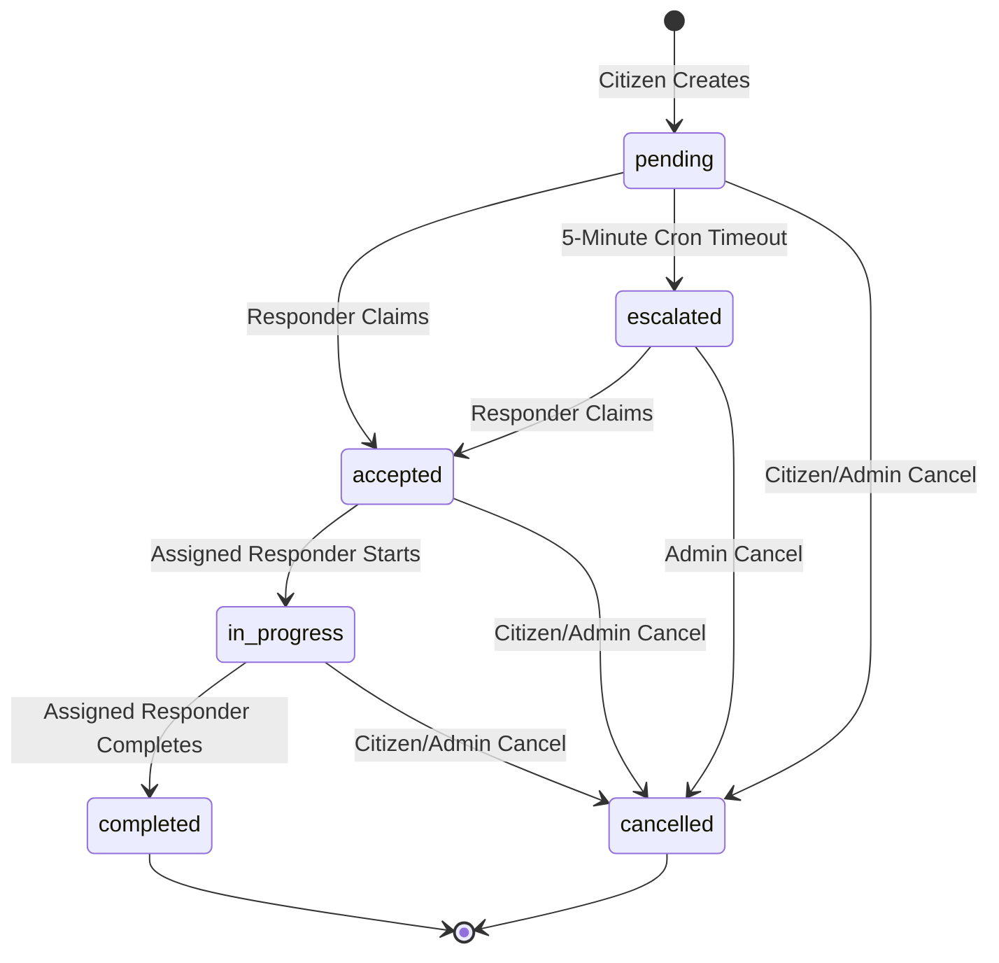

# ERCS Emergency Lifecycle & Transitions Specification

This document defines the emergency lifecycle, roles, validation rules, and claiming behaviors of the Emergency Response Coordination System (ERCS).

---

## 1. Emergency States

The database and backend define the following six emergency states:
1. **`pending`**: Initial state when reported by a citizen. Ready to be claimed.
2. **`accepted`**: Claimed by a responder who is currently preparing to dispatch.
3. **`in_progress`**: The assigned responder has started moving towards the incident location.
4. **`completed`**: The responder successfully resolved the incident. Terminal state.
5. **`cancelled`**: Cancelled by the reporting citizen or an administrator. Terminal state.
6. **`escalated`**: Timeout state when a pending request is not accepted by any responder within 5 minutes.

---

## 2. Transition State Machine

Only the following transitions are valid. Any other status transitions will be rejected by the backend with a `400 Bad Request`.



---

## 3. Role Permissions & Access Control

Operational changes are strictly guarded based on user roles:

### Citizen
* **Privileges**: Can create new emergencies, query own historical submissions, and cancel own emergencies.
* **Access Rules**: Citizens cannot access the administrative dashboard feed, view unrelated emergencies, claim any requests, or update states beyond `cancelled` for their own requests.

### Responder (Approved Police, Fire, Ambulance)
* **Privileges**: Can list all available emergencies, toggle global location sharing, claim available requests, and update the status of claimed requests (`in_progress` and `completed`).
* **Access Rules**: Can only update emergencies assigned to them. Responders cannot change the status of other responders' emergencies, cancel emergencies, or approve other responders.

### Admin
* **Privileges**: Can fetch all metrics, view all audit logs, approve/reject responders, change user roles, delete users, and administratively cancel any emergency.
* **Access Rules**: Full override. Can perform state transitions and bypass typical client limitations.

---

## 4. Operational & Database Rules

### Atomic Claiming
Concurrency claims are protected at the database query level. To prevent two responders from simultaneously claiming the same emergency:
```sql
UPDATE emergencies 
SET status = 'accepted', 
    assigned_responder = ?, 
    responder_lat = ?, 
    responder_lng = ? 
WHERE id = ? AND status IN ('pending', 'escalated')
```
If two database requests execute at the same instant, the first update modifies the row and changes the status to `'accepted'`. The second update affects `0` rows because the status is no longer `'pending'` or `'escalated'`. The backend checks `affectedRows === 0` and returns a `409 Conflict` (already claimed) message.

### Location Coordinate Ranges
All coordinate coordinates submitted during emergency creation are validated against absolute bounds:
- **Latitude**: Must be a number between `-90.0` and `+90.0` inclusive.
- **Longitude**: Must be a number between `-180.0` and `+180.0` inclusive.
All values failing this range check are rejected with a `400 Bad Request`.

### Escalation Timeout Cron
A single-instance scheduler scans for stale records every minute:
- Checks for status = `'pending'` where `created_at` is older than `5 minutes`.
- Updates status to `'escalated'` using atomic conditional criteria (`status = 'pending'`).
- Broadcasts the `emergencyEscalated` real-time socket events.
