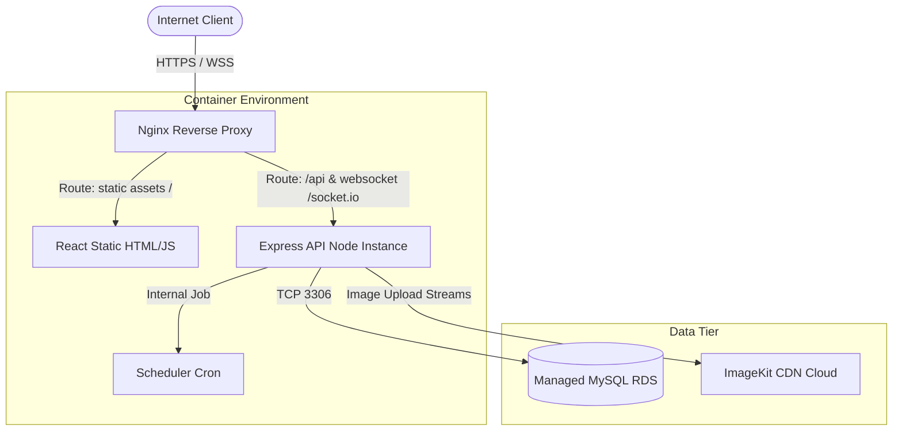

# ERCS Production Deployment & Systems Architecture

This document describes the recommended production deployment architecture for the **Emergency Response Coordination System (ERCS)**. The goal is to provide a cost-effective, secure, and production-ready environment suitable for staging or portfolio presentation.

---

## 1. System Topology

We recommend a **Single-Instance Reverse Proxy topology (Cost-Aware Architecture)** for cost efficiency, while maintaining container isolation and production network configurations.

---

## 2. Component Design

### 1. Reverse Proxy (Nginx)
- **Role:** Handles incoming HTTPS/TLS handshakes, serves static assets (React bundle), redirects SPA route fallbacks to `index.html`, and proxies API/WebSocket requests to the Express server.
- **Configuration Highlights:**
  - Gzip compression enabled for static JS/CSS.
  - Rate limiting mapping for client connections at ingress level.
  - HTTP header controls (X-Frame-Options, Content-Security-Policy).

### 2. Frontend (React SPA)
- **Runtime:** Built into static assets during build (`npm run build`) and compiled into static HTML/CSS/JS files.
- **Web Serving:** Served directly by Nginx without running a node process, reducing CPU and memory overhead.

### 3. Backend (Express Node API & Sockets)
- **Runtime:** Containerized NodeJS application running in `production` mode.
- **Database Pooling:** Managed via `mysql2` connection pools with automatic releases and health probes on `/health`.
- **Background Jobs:** In-process cron scheduler configured with database lock flags to prevent overlapping processes.

### 4. Database Tier (MySQL)
- **Deployment:** Recommended as a managed database service (e.g. AWS RDS MySQL or Aiven MySQL) instead of self-hosted Docker MySQL to guarantee:
  - Automated offsite backups and snapshots.
  - Connection SSL enforcement.
  - Automated patch management.

---

## 3. Production Environment Checklist

| Variable Name | Role | Production Value |
| :--- | :--- | :--- |
| `NODE_ENV` | Runtime environment config | `production` |
| `PORT` | Local express listen port | `5000` |
| `DB_HOST` | Managed database host | `<AWS RDS Endpoint>` |
| `JWT_SECRET` | Cryptographic signature key | `<High Entropy Random Secret String>` |
| `CORS_ORIGINS` | Permitted network boundaries | `https://your-domain.com` |
| `IMAGEKIT_PRIVATE_KEY` | File storage credentials | `<ImageKit Secret Key>` |

---

## 4. Secure HTTPS Deployment Flow

1. **DNS Mapping:** Point the application domain (e.g., `ercs.your-domain.com`) to the load balancer or virtual server hosting Nginx.
2. **TLS Certificate:** Provision a Let's Encrypt SSL/TLS certificate via Certbot auto-renewals on the server.
3. **Proxy Headers:** Ensure Nginx passes original request headers (`X-Real-IP`, `X-Forwarded-For`, and `X-Forwarded-Proto`) to the Express API for secure rate limit keying.
